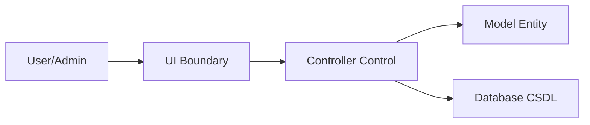

# Danh sách Biểu đồ trình tự (Sequence Diagrams)

Tài liệu này chứa các biểu đồ trình tự cho các Use Case chính trong hệ thống MedBook.

## 1. Authentication
- [Đăng ký (Register)](./auth_register.md)
- [Đăng nhập (Login)](./auth_login.md)
- [Đăng xuất (Logout)](./auth_logout.md)

## 2. Patient Use Cases
- [Tìm kiếm bác sĩ (Search Doctors)](./doctor_search.md)
- [Đặt lịch khám (Appointment Booking)](./appointment_booking.md)
- [Cập nhật thông tin cá nhân (Update Profile)](./profile_update.md)
- [Hồ sơ bệnh án - Xem (View Records)](./medical_records.md)
- [Hồ sơ bệnh án - Thêm (Add Record)](./medical_record_add.md)
- [Hủy lịch khám (Cancel Appointment)](./appointment_cancel.md)
- [Đổi lịch khám (Reschedule Appointment)](./appointment_reschedule.md)
- [Đánh giá bác sĩ (Submit Review)](./doctor_review.md)
- [Thanh toán (Payment Process)](./payment_process.md)

## 3. Admin Use Cases
- [Quản lý người dùng (Admin Users)](./admin_users.md)
- [Quản lý bác sĩ (Admin Doctors)](./admin_doctors.md)
- [Quản lý lịch hẹn (Admin Appointments)](./admin_appointments.md)

---
*Các biểu đồ được xây dựng dựa trên mô hình Boundary-Control-Entity (BCE) như yêu cầu.*

