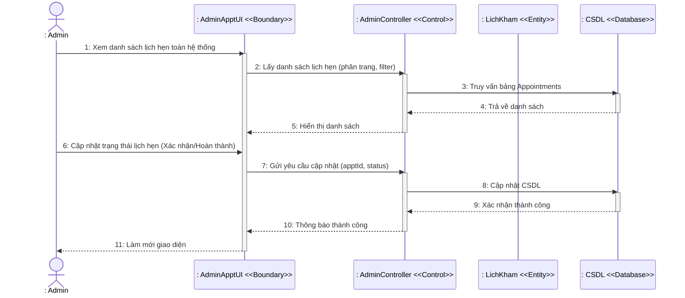

# Biểu đồ trình tự: Quản lý lịch hẹn (Admin: Manage Appointments)

```mermaid
sequenceDiagram
    actor Admin as : Admin
    participant AdminUI as : AdminApptUI <<Boundary>>
    participant AdminController as : AdminController <<Control>>
    participant LichKham as : LichKham <<Entity>>
    participant CSDL as : CSDL <<Database>>

    Admin->>AdminUI: 1: Xem danh sách lịch hẹn toàn hệ thống
    activate AdminUI
    AdminUI->>AdminController: 2: Lấy danh sách lịch hẹn (phân trang, filter)
    activate AdminController
    AdminController->>CSDL: 3: Truy vấn bảng Appointments
    activate CSDL
    CSDL-->>AdminController: 4: Trả về danh sách
    deactivate CSDL
    AdminController-->>AdminUI: 5: Hiển thị danh sách
    deactivate AdminController

    Admin->>AdminUI: 6: Cập nhật trạng thái lịch hẹn (Xác nhận/Hoàn thành)
    AdminUI->>AdminController: 7: Gửi yêu cầu cập nhật (apptId, status)
    activate AdminController
    AdminController->>CSDL: 8: Cập nhật CSDL
    activate CSDL
    CSDL-->>AdminController: 9: Xác nhận thành công
    deactivate CSDL
    AdminController-->>AdminUI: 10: Thông báo thành công
    deactivate AdminController
    AdminUI-->>Admin: 11: Làm mới giao diện
    deactivate AdminUI
```
