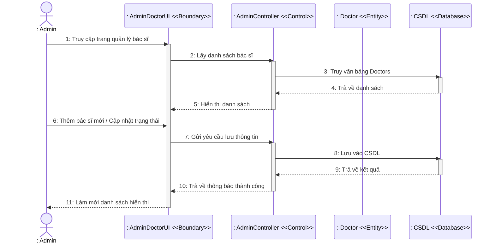

# Biểu đồ trình tự: Quản lý bác sĩ (Admin: Manage Doctors)

```mermaid
sequenceDiagram
    actor Admin as : Admin
    participant AdminUI as : AdminDoctorUI <<Boundary>>
    participant AdminController as : AdminController <<Control>>
    participant Doctor as : Doctor <<Entity>>
    participant CSDL as : CSDL <<Database>>

    Admin->>AdminUI: 1: Truy cập trang quản lý bác sĩ
    activate AdminUI
    AdminUI->>AdminController: 2: Lấy danh sách bác sĩ
    activate AdminController
    AdminController->>CSDL: 3: Truy vấn bảng Doctors
    activate CSDL
    CSDL-->>AdminController: 4: Trả về danh sách
    deactivate CSDL
    AdminController-->>AdminUI: 5: Hiển thị danh sách
    deactivate AdminController

    Admin->>AdminUI: 6: Thêm bác sĩ mới / Cập nhật trạng thái
    AdminUI->>AdminController: 7: Gửi yêu cầu lưu thông tin
    activate AdminController
    AdminController->>CSDL: 8: Lưu vào CSDL
    activate CSDL
    CSDL-->>AdminController: 9: Trả về kết quả
    deactivate CSDL
    AdminController-->>AdminUI: 10: Trả về thông báo thành công
    deactivate AdminController
    AdminUI-->>Admin: 11: Làm mới danh sách hiển thị
    deactivate AdminUI
```
