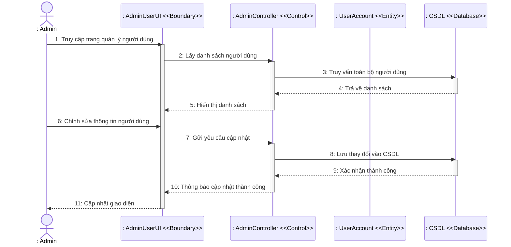

# Biểu đồ trình tự: Quản lý người dùng (Admin: Manage Users)

```mermaid
sequenceDiagram
    actor Admin as : Admin
    participant AdminUI as : AdminUserUI <<Boundary>>
    participant AdminController as : AdminController <<Control>>
    participant UserAccount as : UserAccount <<Entity>>
    participant CSDL as : CSDL <<Database>>

    Admin->>AdminUI: 1: Truy cập trang quản lý người dùng
    activate AdminUI
    AdminUI->>AdminController: 2: Lấy danh sách người dùng
    activate AdminController
    AdminController->>CSDL: 3: Truy vấn toàn bộ người dùng
    activate CSDL
    CSDL-->>AdminController: 4: Trả về danh sách
    deactivate CSDL
    AdminController-->>AdminUI: 5: Hiển thị danh sách
    deactivate AdminController

    Admin->>AdminUI: 6: Chỉnh sửa thông tin người dùng
    AdminUI->>AdminController: 7: Gửi yêu cầu cập nhật
    activate AdminController
    AdminController->>CSDL: 8: Lưu thay đổi vào CSDL
    activate CSDL
    CSDL-->>AdminController: 9: Xác nhận thành công
    deactivate CSDL
    AdminController-->>AdminUI: 10: Thông báo cập nhật thành công
    deactivate AdminController
    AdminUI-->>Admin: 11: Cập nhật giao diện
    deactivate AdminUI
```
