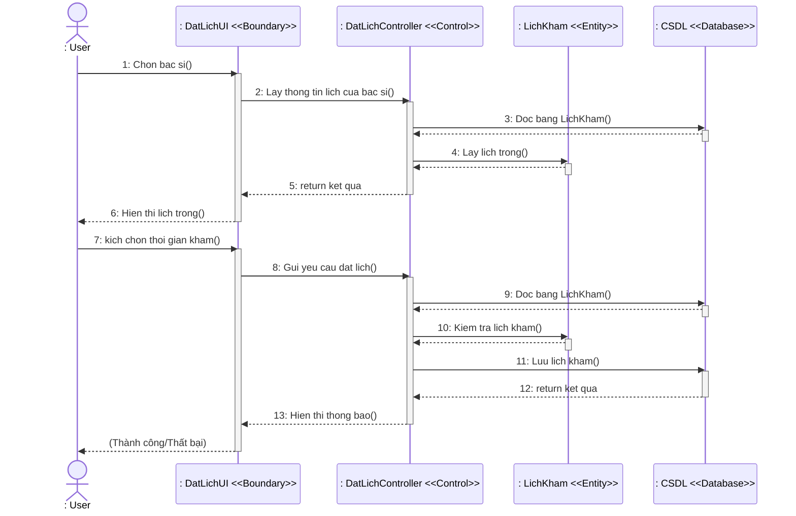

# Biểu đồ trình tự: Đặt lịch khám (Appointment Booking)

```mermaid
sequenceDiagram
    actor User as : User
    participant DatLichUI as : DatLichUI <<Boundary>>
    participant DatLichController as : DatLichController <<Control>>
    participant LichKham as : LichKham <<Entity>>
    participant CSDL as : CSDL <<Database>>

    User->>DatLichUI: 1: Chon bac si()
    activate DatLichUI
    DatLichUI->>DatLichController: 2: Lay thong tin lich cua bac si()
    activate DatLichController
    DatLichController->>CSDL: 3: Doc bang LichKham()
    activate CSDL
    CSDL-->>DatLichController: 
    deactivate CSDL
    DatLichController->>LichKham: 4: Lay lich trong()
    activate LichKham
    LichKham-->>DatLichController: 
    deactivate LichKham
    DatLichController-->>DatLichUI: 5: return ket qua
    deactivate DatLichController
    DatLichUI-->>User: 6: Hien thi lich trong()
    deactivate DatLichUI

    User->>DatLichUI: 7: kich chon thoi gian kham()
    activate DatLichUI
    DatLichUI->>DatLichController: 8: Gui yeu cau dat lich()
    activate DatLichController
    DatLichController->>CSDL: 9: Doc bang LichKham()
    activate CSDL
    CSDL-->>DatLichController: 
    deactivate CSDL
    DatLichController->>LichKham: 10: Kiem tra lich kham()
    activate LichKham
    LichKham-->>DatLichController: 
    deactivate LichKham
    DatLichController->>CSDL: 11: Luu lich kham()
    activate CSDL
    CSDL-->>DatLichController: 12: return ket qua
    deactivate CSDL
    DatLichController-->>DatLichUI: 13: Hien thi thong bao()
    deactivate DatLichController
    DatLichUI-->>User: (Thành công/Thất bại)
    deactivate DatLichUI
```
