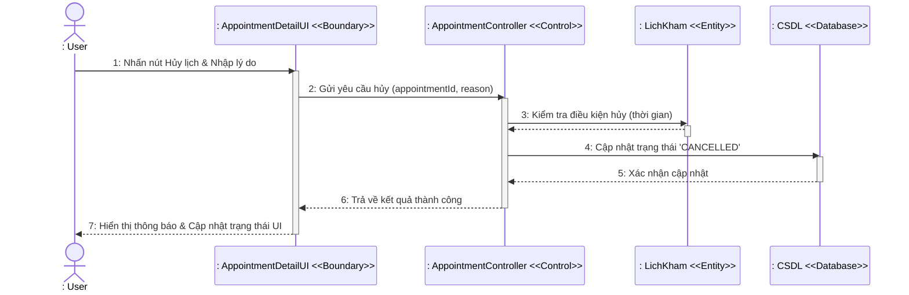

# Biểu đồ trình tự: Hủy lịch khám (Cancel Appointment)

```mermaid
sequenceDiagram
    actor User as : User
    participant AppointmentUI as : AppointmentDetailUI <<Boundary>>
    participant ApptController as : AppointmentController <<Control>>
    participant LichKham as : LichKham <<Entity>>
    participant CSDL as : CSDL <<Database>>

    User->>AppointmentUI: 1: Nhấn nút Hủy lịch & Nhập lý do
    activate AppointmentUI
    AppointmentUI->>ApptController: 2: Gửi yêu cầu hủy (appointmentId, reason)
    activate ApptController
    ApptController->>LichKham: 3: Kiểm tra điều kiện hủy (thời gian)
    activate LichKham
    LichKham-->>ApptController: 
    deactivate LichKham
    ApptController->>CSDL: 4: Cập nhật trạng thái 'CANCELLED'
    activate CSDL
    CSDL-->>ApptController: 5: Xác nhận cập nhật
    deactivate CSDL
    ApptController-->>AppointmentUI: 6: Trả về kết quả thành công
    deactivate ApptController
    AppointmentUI-->>User: 7: Hiển thị thông báo & Cập nhật trạng thái UI
    deactivate AppointmentUI
```
