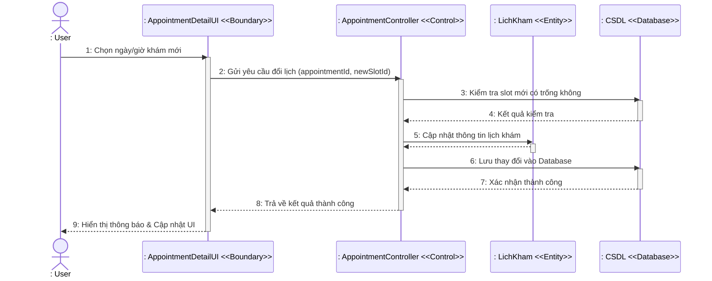

# Biểu đồ trình tự: Đổi lịch khám (Reschedule Appointment)

```mermaid
sequenceDiagram
    actor User as : User
    participant ApptUI as : AppointmentDetailUI <<Boundary>>
    participant ApptController as : AppointmentController <<Control>>
    participant LichKham as : LichKham <<Entity>>
    participant CSDL as : CSDL <<Database>>

    User->>ApptUI: 1: Chọn ngày/giờ khám mới
    activate ApptUI
    ApptUI->>ApptController: 2: Gửi yêu cầu đổi lịch (appointmentId, newSlotId)
    activate ApptController
    ApptController->>CSDL: 3: Kiểm tra slot mới có trống không
    activate CSDL
    CSDL-->>ApptController: 4: Kết quả kiểm tra
    deactivate CSDL
    ApptController->>LichKham: 5: Cập nhật thông tin lịch khám
    activate LichKham
    LichKham-->>ApptController: 
    deactivate LichKham
    ApptController->>CSDL: 6: Lưu thay đổi vào Database
    activate CSDL
    CSDL-->>ApptController: 7: Xác nhận thành công
    deactivate CSDL
    ApptController-->>ApptUI: 8: Trả về kết quả thành công
    deactivate ApptController
    ApptUI-->>User: 9: Hiển thị thông báo & Cập nhật UI
    deactivate ApptUI
```
