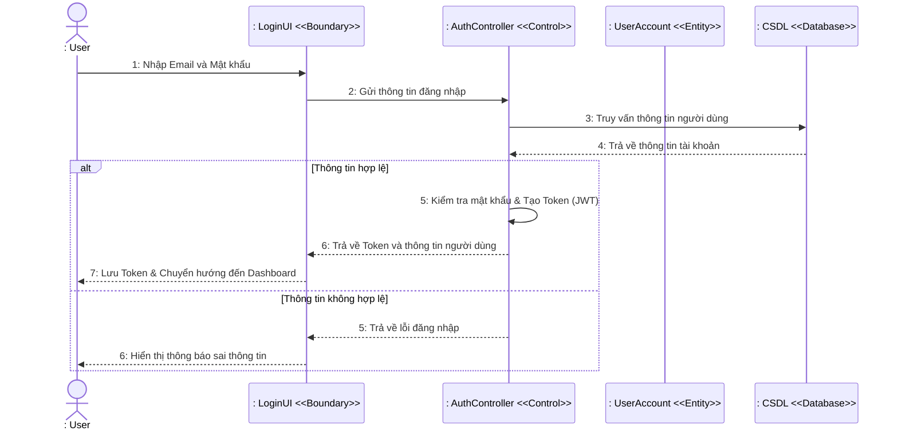

# Biểu đồ trình tự: Đăng nhập (Login)

```mermaid
sequenceDiagram
    actor User as : User
    participant LoginUI as : LoginUI <<Boundary>>
    participant AuthController as : AuthController <<Control>>
    participant UserAccount as : UserAccount <<Entity>>
    participant CSDL as : CSDL <<Database>>

    User->>LoginUI: 1: Nhập Email và Mật khẩu
    LoginUI->>AuthController: 2: Gửi thông tin đăng nhập
    AuthController->>CSDL: 3: Truy vấn thông tin người dùng
    CSDL-->>AuthController: 4: Trả về thông tin tài khoản
    
    alt Thông tin hợp lệ
        AuthController->>AuthController: 5: Kiểm tra mật khẩu & Tạo Token (JWT)
        AuthController-->>LoginUI: 6: Trả về Token và thông tin người dùng
        LoginUI-->>User: 7: Lưu Token & Chuyển hướng đến Dashboard
    else Thông tin không hợp lệ
        AuthController-->>LoginUI: 5: Trả về lỗi đăng nhập
        LoginUI-->>User: 6: Hiển thị thông báo sai thông tin
    end
```
