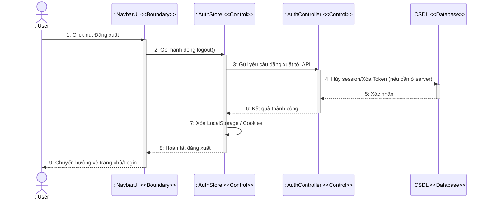

# Biểu đồ trình tự: Đăng xuất (Logout)

```mermaid
sequenceDiagram
    actor User as : User
    participant Navbar as : NavbarUI <<Boundary>>
    participant AuthStore as : AuthStore <<Control>>
    participant AuthController as : AuthController <<Control>>
    participant CSDL as : CSDL <<Database>>

    User->>Navbar: 1: Click nút Đăng xuất
    activate Navbar
    Navbar->>AuthStore: 2: Gọi hành động logout()
    activate AuthStore
    AuthStore->>AuthController: 3: Gửi yêu cầu đăng xuất tới API
    activate AuthController
    AuthController->>CSDL: 4: Hủy session/Xóa Token (nếu cần ở server)
    activate CSDL
    CSDL-->>AuthController: 5: Xác nhận
    deactivate CSDL
    AuthController-->>AuthStore: 6: Kết quả thành công
    deactivate AuthController
    AuthStore->>AuthStore: 7: Xóa LocalStorage / Cookies
    AuthStore-->>Navbar: 8: Hoàn tất đăng xuất
    deactivate AuthStore
    Navbar-->>User: 9: Chuyển hướng về trang chủ/Login
    deactivate Navbar
```
