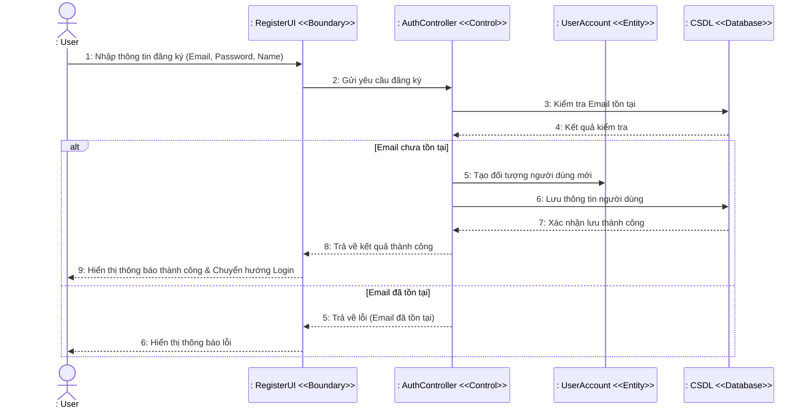

# Biểu đồ trình tự: Đăng ký (Register)

```mermaid
sequenceDiagram
    actor User as : User
    participant RegisterUI as : RegisterUI <<Boundary>>
    participant AuthController as : AuthController <<Control>>
    participant UserAccount as : UserAccount <<Entity>>
    participant CSDL as : CSDL <<Database>>

    User->>RegisterUI: 1: Nhập thông tin đăng ký (Email, Password, Name)
    RegisterUI->>AuthController: 2: Gửi yêu cầu đăng ký
    AuthController->>CSDL: 3: Kiểm tra Email tồn tại
    CSDL-->>AuthController: 4: Kết quả kiểm tra
    
    alt Email chưa tồn tại
        AuthController->>UserAccount: 5: Tạo đối tượng người dùng mới
        AuthController->>CSDL: 6: Lưu thông tin người dùng
        CSDL-->>AuthController: 7: Xác nhận lưu thành công
        AuthController-->>RegisterUI: 8: Trả về kết quả thành công
        RegisterUI-->>User: 9: Hiển thị thông báo thành công & Chuyển hướng Login
    else Email đã tồn tại
        AuthController-->>RegisterUI: 5: Trả về lỗi (Email đã tồn tại)
        RegisterUI-->>User: 6: Hiển thị thông báo lỗi
    end
```
