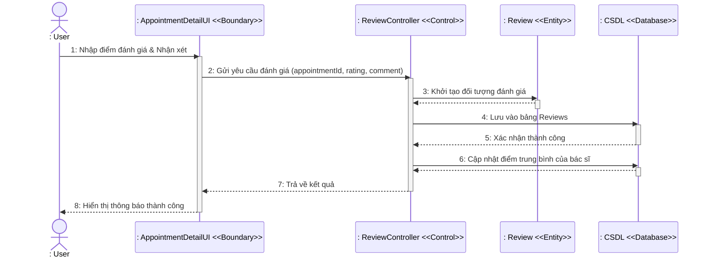

# Biểu đồ trình tự: Đánh giá bác sĩ (Submit Review)

```mermaid
sequenceDiagram
    actor User as : User
    participant ApptUI as : AppointmentDetailUI <<Boundary>>
    participant ReviewController as : ReviewController <<Control>>
    participant Review as : Review <<Entity>>
    participant CSDL as : CSDL <<Database>>

    User->>ApptUI: 1: Nhập điểm đánh giá & Nhận xét
    activate ApptUI
    ApptUI->>ReviewController: 2: Gửi yêu cầu đánh giá (appointmentId, rating, comment)
    activate ReviewController
    ReviewController->>Review: 3: Khởi tạo đối tượng đánh giá
    activate Review
    Review-->>ReviewController: 
    deactivate Review
    ReviewController->>CSDL: 4: Lưu vào bảng Reviews
    activate CSDL
    CSDL-->>ReviewController: 5: Xác nhận thành công
    deactivate CSDL
    ReviewController->>CSDL: 6: Cập nhật điểm trung bình của bác sĩ
    activate CSDL
    CSDL-->>ReviewController: 
    deactivate CSDL
    ReviewController-->>ApptUI: 7: Trả về kết quả
    deactivate ReviewController
    ApptUI-->>User: 8: Hiển thị thông báo thành công
    deactivate ApptUI
```
