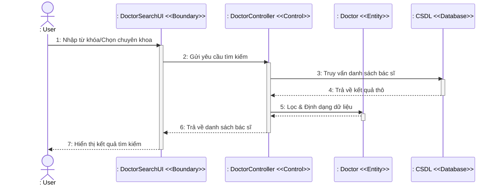

# Biểu đồ trình tự: Tìm kiếm bác sĩ (Search Doctors)

```mermaid
sequenceDiagram
    actor User as : User
    participant DoctorSearchUI as : DoctorSearchUI <<Boundary>>
    participant DoctorController as : DoctorController <<Control>>
    participant Doctor as : Doctor <<Entity>>
    participant CSDL as : CSDL <<Database>>

    User->>DoctorSearchUI: 1: Nhập từ khóa/Chọn chuyên khoa
    activate DoctorSearchUI
    DoctorSearchUI->>DoctorController: 2: Gửi yêu cầu tìm kiếm
    activate DoctorController
    DoctorController->>CSDL: 3: Truy vấn danh sách bác sĩ
    activate CSDL
    CSDL-->>DoctorController: 4: Trả về kết quả thô
    deactivate CSDL
    DoctorController->>Doctor: 5: Lọc & Định dạng dữ liệu
    activate Doctor
    Doctor-->>DoctorController: 
    deactivate Doctor
    DoctorController-->>DoctorSearchUI: 6: Trả về danh sách bác sĩ
    deactivate DoctorController
    DoctorSearchUI-->>User: 7: Hiển thị kết quả tìm kiếm
    deactivate DoctorSearchUI
```
