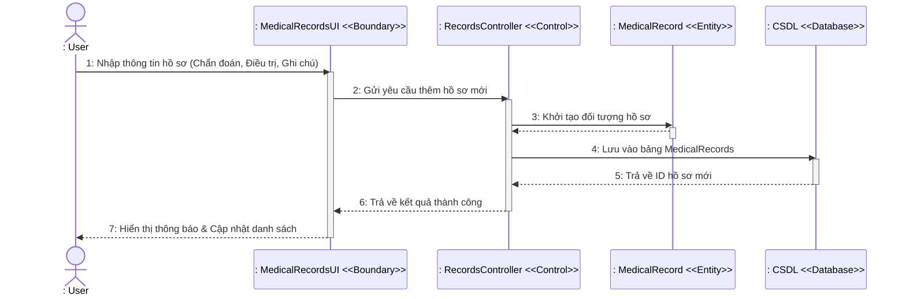

# Biểu đồ trình tự: Thêm hồ sơ bệnh án (Add Medical Record)

```mermaid
sequenceDiagram
    actor User as : User
    participant RecordsUI as : MedicalRecordsUI <<Boundary>>
    participant RecordsController as : RecordsController <<Control>>
    participant MedicalRecord as : MedicalRecord <<Entity>>
    participant CSDL as : CSDL <<Database>>

    User->>RecordsUI: 1: Nhập thông tin hồ sơ (Chẩn đoán, Điều trị, Ghi chú)
    activate RecordsUI
    RecordsUI->>RecordsController: 2: Gửi yêu cầu thêm hồ sơ mới
    activate RecordsController
    RecordsController->>MedicalRecord: 3: Khởi tạo đối tượng hồ sơ
    activate MedicalRecord
    MedicalRecord-->>RecordsController: 
    deactivate MedicalRecord
    RecordsController->>CSDL: 4: Lưu vào bảng MedicalRecords
    activate CSDL
    CSDL-->>RecordsController: 5: Trả về ID hồ sơ mới
    deactivate CSDL
    RecordsController-->>RecordsUI: 6: Trả về kết quả thành công
    deactivate RecordsController
    RecordsUI-->>User: 7: Hiển thị thông báo & Cập nhật danh sách
    deactivate RecordsUI
```
