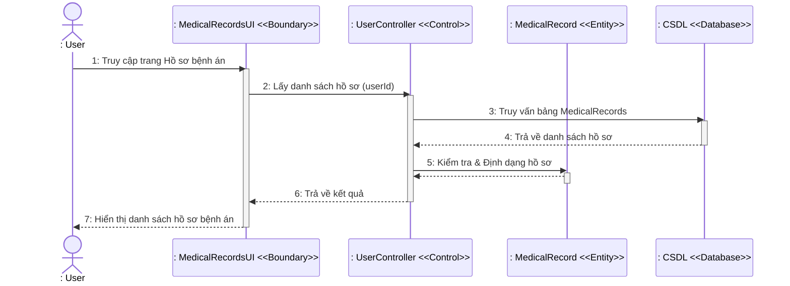

# Biểu đồ trình tự: Xem hồ sơ bệnh án (View Medical Records)

```mermaid
sequenceDiagram
    actor User as : User
    participant RecordsUI as : MedicalRecordsUI <<Boundary>>
    participant UserController as : UserController <<Control>>
    participant MedicalRecord as : MedicalRecord <<Entity>>
    participant CSDL as : CSDL <<Database>>

    User->>RecordsUI: 1: Truy cập trang Hồ sơ bệnh án
    activate RecordsUI
    RecordsUI->>UserController: 2: Lấy danh sách hồ sơ (userId)
    activate UserController
    UserController->>CSDL: 3: Truy vấn bảng MedicalRecords
    activate CSDL
    CSDL-->>UserController: 4: Trả về danh sách hồ sơ
    deactivate CSDL
    UserController->>MedicalRecord: 5: Kiểm tra & Định dạng hồ sơ
    activate MedicalRecord
    MedicalRecord-->>UserController: 
    deactivate MedicalRecord
    UserController-->>RecordsUI: 6: Trả về kết quả
    deactivate UserController
    RecordsUI-->>User: 7: Hiển thị danh sách hồ sơ bệnh án
    deactivate RecordsUI
```
