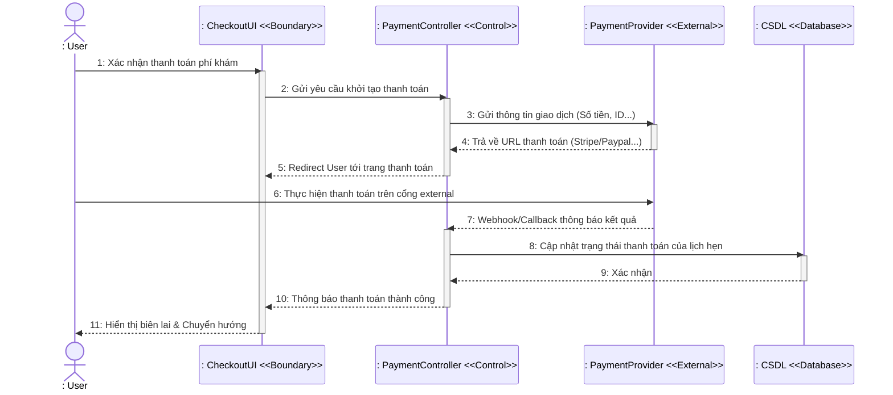

# Biểu đồ trình tự: Thanh toán (Payment Process)

```mermaid
sequenceDiagram
    actor User as : User
    participant CheckoutUI as : CheckoutUI <<Boundary>>
    participant PaymentController as : PaymentController <<Control>>
    participant PaymentProvider as : PaymentProvider <<External>>
    participant CSDL as : CSDL <<Database>>

    User->>CheckoutUI: 1: Xác nhận thanh toán phí khám
    activate CheckoutUI
    CheckoutUI->>PaymentController: 2: Gửi yêu cầu khởi tạo thanh toán
    activate PaymentController
    PaymentController->>PaymentProvider: 3: Gửi thông tin giao dịch (Số tiền, ID...)
    activate PaymentProvider
    PaymentProvider-->>PaymentController: 4: Trả về URL thanh toán (Stripe/Paypal...)
    deactivate PaymentProvider
    PaymentController-->>CheckoutUI: 5: Redirect User tới trang thanh toán
    deactivate PaymentController
    
    User->>PaymentProvider: 6: Thực hiện thanh toán trên cổng external
    PaymentProvider-->>PaymentController: 7: Webhook/Callback thông báo kết quả
    activate PaymentController
    PaymentController->>CSDL: 8: Cập nhật trạng thái thanh toán của lịch hẹn
    activate CSDL
    CSDL-->>PaymentController: 9: Xác nhận
    deactivate CSDL
    PaymentController-->>CheckoutUI: 10: Thông báo thanh toán thành công
    deactivate PaymentController
    CheckoutUI-->>User: 11: Hiển thị biên lai & Chuyển hướng
    deactivate CheckoutUI
```
