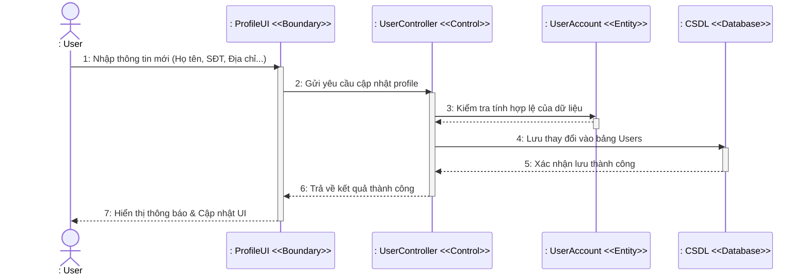

# Biểu đồ trình tự: Cập nhật thông tin cá nhân (Update Profile)

```mermaid
sequenceDiagram
    actor User as : User
    participant ProfileUI as : ProfileUI <<Boundary>>
    participant UserController as : UserController <<Control>>
    participant UserAccount as : UserAccount <<Entity>>
    participant CSDL as : CSDL <<Database>>

    User->>ProfileUI: 1: Nhập thông tin mới (Họ tên, SĐT, Địa chỉ...)
    activate ProfileUI
    ProfileUI->>UserController: 2: Gửi yêu cầu cập nhật profile
    activate UserController
    UserController->>UserAccount: 3: Kiểm tra tính hợp lệ của dữ liệu
    activate UserAccount
    UserAccount-->>UserController: 
    deactivate UserAccount
    UserController->>CSDL: 4: Lưu thay đổi vào bảng Users
    activate CSDL
    CSDL-->>UserController: 5: Xác nhận lưu thành công
    deactivate CSDL
    UserController-->>ProfileUI: 6: Trả về kết quả thành công
    deactivate UserController
    ProfileUI-->>User: 7: Hiển thị thông báo & Cập nhật UI
    deactivate ProfileUI
```
